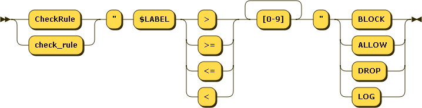

# Checkrules

CheckRules instruct naxsi to take an action (`LOG`, `BLOCK`, `DROP`, `ALLOW`) based on a specific score associated to the request. This _score_ has usually been set by one or several [rule(s)](rules-bnf.md).

`CheckRule` must be present at location level.



### Basic Usage

A typical `CheckRule` is :

```
CheckRule "$SQL >= 8" BLOCK;
```

If the `$SQL` is equal or superior to '8', apply BLOCK flag to the request. Request will only be blocked if location is _not_ in learning mode.

### Other Usages

`CheckRule(s)` can as well be used to mix white and black-lists.
Having a configuration mixing virtual-patching (see [rules](rules-bnf.md)) and `naxsi_core.rules`, it is possible to have :

```
CheckRule "$UWA >= 4" DROP;
CheckRule "$XSS >= 8" BLOCK;
```

Thus - even in learning mode - any request with `$UWA` score equal to 4 will block the requests, while requests with `$XSS` score (even superior to 8) will only be blocked on location(s) *not* in learning.


