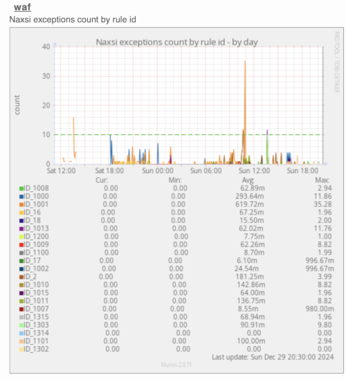

# Integration with Naxsi

Naxsi is not only versatile enough to standalone but also highly adaptable, allowing for integration with an array of other tools and software solutions. A selection of compatible tools that can be integrated with Naxsi is provided below.

## Integration with Fail2Ban

[Fail2Ban](https://github.com/fail2ban/fail2ban) scans logs and bans IP addresses conducting too many failed login attempts. It does this by updating system firewall rules to reject new connections from those IP addresses, for a configurable amount of time. Fail2Ban comes out-of-the-box ready to read many standard log files, such as those for sshd and Apache, and is easily configured to read any log file of your choosing, for any error you wish.

### Configuration

Create `/etc/fail2ban/filter.d/nginx-naxsi.conf` and paste the following configuration.

```ini
[INCLUDES]
before = common.conf
[Definition]
failregex = NAXSI_FMT: ip=<HOST>&server=.*&uri=.*&config=learning-drop&
            NAXSI_FMT: ip=<HOST>&server=.*&uri=.*&config=block&
            NAXSI_FMT: ip=<HOST>&server=.*&uri=.*&config=drop&
ignoreregex = NAXSI_FMT: ip=<HOST>&server=.*&uri=.*&config=learning&
              NAXSI_FMT: ip=<HOST>&server=.*&uri=.*&config=ignore&
```

Add a new section within `/etc/fail2ban/jail.conf` containing the following configuration.

Be sure that `logpath` points to the error logs where naxsi writes (this can be also pointed to the systemd logs).

```ini
[nginx-naxsi]
enabled = true
port = http,https
filter = nginx-naxsi
logpath = /var/log/nginx/*error.log
maxretry = 6
```

This configures fail2ban to generate a ban for any IP which triggers Naxsi 6 times within a 5 minutes window (see `fail2ban findtime=600`).

It is possible to track, via [Munin](https://munin-monitoring.org/) for example, the events generated by Fail2Ban's jail rules.

### Links

- Fail2Ban website: [https://github.com/fail2ban/fail2ban](https://github.com/fail2ban/fail2ban)

## Rules monitoring with Munin

> ⚠️ Warning
>
> This is a 3rd party integration not maintained by the Naxsi team.

[Munin](https://munin-monitoring.org/) is a networked resource monitoring tool that can help analyze resource trends and "what just happened to kill our performance?" problems. It is designed to be very plug and play. A default installation provides a lot of graphs with almost no work.



Use this plugin in Munin to monitor the number of times your NAXSI firewall is triggered by rule violations. This approach lets you experiment with different rules and whitelists while in [learning mode](directives.md#learningmode), then activate the WAF once confident enough about its configuration.

### Links

- Munin website: [https://munin-monitoring.org/](https://munin-monitoring.org/)
- Naxsi Munin plugin: [https://github.com/munin-monitoring/contrib/tree/master/plugins/naxsi](https://github.com/munin-monitoring/contrib/tree/master/plugins/naxsi)
