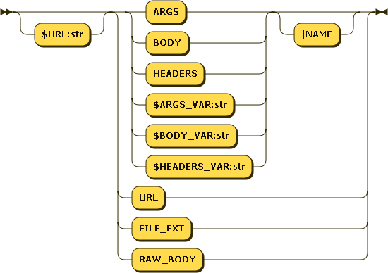
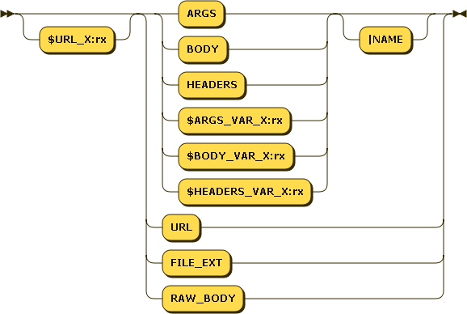

## Match Zones

Match Zones *mz* are present in rules and whitelists. It is used to specify where a pattern should be searched (rules) or where it should be allowed (whitelist).
Please note that matchzones behave a bit differently in rules and whitelists : In rules each condition is *OR* (ie. in `BODY` _or_ in `HEADERS`), 
while in whitelist it's *AND* (ie. url must be `/foo` _and_ exception must happen in `ARGS`)

### Global Zones

4 main zones exist : URL, ARGS, HEADERS, BODY, and matchzone can be more or less restrictive.

A mz can be wide :

- `ARGS`: GET args
- `HEADERS `: HTTP Headers 
- `BODY `: POST args (and RAW_BODY)
- `URL`: The URL itself (before '?') 
- `ALL`: TODO DOCUMENTATION

Or more specific :

- `$ARGS_VAR:string`: named GET argument 
- `$HEADERS_VAR:string` : named HTTP header 
- `$BODY_VAR:string`: named POST argument 

Sometime, regular expressions are needed (ie. variable names can vary) :

- `$HEADERS_VAR_X:regex`: regex matching a named HTTP header (>= 0.52)
- `$ARGS_VAR_X:regex`: regex matching the name of a GET argument (>= 0.52)
- `$BODY_VAR_X:regex`: regex matching the name of a POST argument (>= 0.52)

A matchzone can be restricted to a specific URL :
(_but is not a zone on its own_)

- `$URL:string`: restricted to this url
- `$URL_X:regex`: restricted to url matching regex (>= 0.52)

A matchzone that targets BODY,HEADERS,ARGS can add `|NAME` to *specify* the target is not 
the content of a variable, but its name itself. 

It is useful in specific contexts (ie. whitelist `[ ]` in form var names on url /foo)

`BasicRule  id:1310,1311 "mz:$URL:/foo|BODY|NAME";`

more specific, match-zones :
- `FILE_EXT`: Filename (in a multipart POST containing a file)
- `RAW_BODY`: A raw, unparsed representation of the BODY of a http request (>= 0.55rc0)

### Match Zone

A matchzone is a combination of one or several zone with an optional url.

In most situations, variable name and url can be predicted, and a static mz can be created :

When regular expressions are needed :

*note:* You CANNOT mix regex (`$URL_X`) and static (`$ARGS_VAR`) in a rule.

*$URL* and *$URL_X* are only used to restrict the scope of a matchzone, and are not specifying the zone.

### Whitelists matchzones

In whitelist context, *all* conditions must be satisfied :

`BasicRule wl:X "mz:$ARGS_VAR:foo|$URL:/bar";` \
_id X is whitelisted in GET variable 'foo' on URL '/bar'_

### Rules matchzones

In rules context, `$URL` or `$URL_X` *must* be satisfied if present. Any other condition is treated as *OR* (opposite to whitelists).

`BasicRule str:Y id:X "mz:ARGS|BODY";`
_pattern 'Y' will be matched against *any* GET and POST arguements_

`BasicRule str:Y id:X "mz:ARGS|BODY|$URL:/foo";`
_pattern 'Y' will be matched against *any* GET and POST arguements as long as URL is /foo_

### Regex vs String

Matchzones composed of static (`$*_VAR:` `$URL:`) matchzones are stored in hashtables, and thus optimal. 
Regex matchzones (`$*_VAR_X:` `$URL_X:`) require more runtime processing. 
It is *not* possible to mix static and regex matchzone in a same rule/whitelist : `mz:$ARGS_VAR_X:^foo$|$URL:/x` or `mz:$URL_X:/foo|$ARGS_VAR:x` are wrong.
