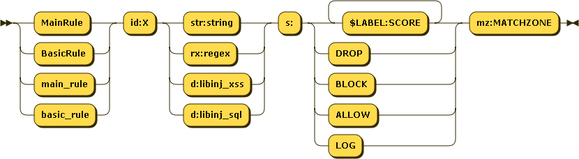
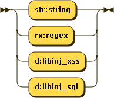
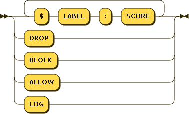

# Rules

Rules are meant to search for patterns in parts of a request to detect attacks.

ie. DROP any request containing the string 'zz' in *any* GET or POST argument :
`MainRule id:424242 "str:zz" "mz:ARGS|BODY" "s:DROP";`

Rules can be present at `location` level (`BasicRule`) or at `http` level (`MainRule`). 

Rules have the following schema :



Everything must be quoted with double quotes, except the id part.

### ID (id:...)

`id:num` is the *unique* numerical ID of the rule, that will be used in `NAXSI_FMT` or whitelists.

IDs inferior to `1000` are reserved for naxsi internal rules (protocol mismatch etc.)

### Match Pattern



Match pattern can be a regular expression, a string match, or a call to a lib (libinjection) :

* `rx:foo|bar` : will match `foo` or `bar`
* `str:foo|bar` : will match `foo|bar`
* `d:libinj_xss` : will match if libinjection says it's XSS (**>= 0.55rc2**)
* `d:libinj_sql` : will match if libinjection says it's SQLi (**>= 0.55rc2**)

Using plain string match when possible is recommended, as it's way faster.
All strings *must* be lowercase, since naxsi's matches are case insensitive.

### Score (s:...)



**s** is the score section. You can create "named" counters: `s:$FOOBAR:4` will increase counter `$FOOBAR` value by 4. One rule can increase several scores: `s:$FOO:4,$BAR:8` will increase both `$FOO` by 4 and `$BAR` by 8. 
A rule can as well directly specifiy an action such a BLOCK (blocks the request in non-learning mode) or DROP (blocks the request **even** in learning mode)
Named scores are later handled by [CheckRules](checkrules-bnf.md).

### MatchZone (mz:...)

Please refer to [Match Zones](matchzones-bnf.md) for details.

**mz** is the match zone, defining which part of the request will be inspected by the rule.

In rules, all matchzones but `$URL*:` are treated as *OR* conditions :

`MainRule id:4242 str:z "mz:$ARGS_VAR:X|BODY";`

pattern 'z' will be searched in GET var 'X' and *all* BODY vars.

`MainRule id:4242 str:z "mz:$ARGS_VAR:X|BODY|$URL_X:^/foo";`

pattern 'z' will be searched in GET var 'X' and all BODY vars *as long as* URL starts with `/foo`.

Starting from naxsi **0.55rc0**, for unknown content-types, you can use the `RAW_BODY` match-zone. `RAW_BODY` rules looks like that:

```
MainRule id:4241 s:DROP str:RANDOMTHINGS mz:RAW_BODY;
```

Rules in the `RAW_BODY` zone will only applied when:
 - The *Content-type* is unknown (which means naxsi doesn't know how to properly parse the request)
 - `id 11` (which is the internal blocking rule for 'unknown content-type') is whitelisted.

Then, the full body (url decoded and with null-bytes replaced by '0') is passed to this set of rules.
The full body is matched again the regexes or string matches.

Whitelists for `RAW_BODY` rules are actually written just like normal body rules, such as:

```
BasicRule wl:4241 "mz:$URL:/rata|BODY";
```

### Human readable message (msg:...)

**msg** is a string describing the pattern. This is mostly used for analyzing and to have some human-understandable text.

### Negative Keyword (negative)

**negative** is a keyword that can be used to make a negative rule.
Score is applied when the rule doesn't match :

```
MainRule negative "rx:multipart/form-data|application/x-www-form-urlencoded" "msg:Content is neither mulipart/x-www-form.." "mz:$HEADERS_VAR:Content-type" "s:$EVADE:4" id:1402;
```
